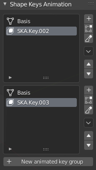

# DuSKA - Duduf Shape Keys Animator

DuSKA is an add-on for [*Blender*](http://blender.org) to help with animation of shape keys.

It is very useful for:

- Fake Stop-Motion/*Claymation*.
- Post-Animation corrective *Shape Keys* with rigged characters.

Without this add-on, to animate *Shape Keys* in Blender, you'd have to animate all of their values between 0 and 1, taking care of the mix between them if you'd like to interpolate. *DuSKA* provides a very simple animatable list with the *Shape Keys* where you can just select the keys to activate them; *DuSKA* takes care of the values and interpolations for you.

[TOC]

## Installation

*DuSKA* is installed as any other add-on in *Blender*: in `Preferences ▸ Add-ons`, choose *install* and select the *DuSKA* *.zip* archive. Don't forget to enable the add-on once installed.

## Use

`3D View ▸ Sidebar ▸ Item tab ▸ Shape Keys Animation`

When a compatible object is selected (*Curve* or *Mesh*), you can add new Animated Shape Keys with the *Shape Keys Animation* panel.

- *New Animated Key* adds a new Keyframe from the basis.
- *Edit Animated Key* activates the *Shape Key* corresponding to the current *Animated Key* and switches to *Edit mode*.
- *Edit Animated Key* activates the *Shape Key* corresponding to the current *Animated Key* and switches to *Sculpt mode*.
- Use the **▲ ▼** *Move Key* buttons to re-arrange the *Animated Keys* in the list.

!!! Note
    *DuSKA*'s list uses the displayed names to pick the right *Shape Keys* on the object. If a *SKA* key does not find its counterpart in the *Shape Keys* (because it has been removed or renamed), a warning sign will be shown. You can either safely remove it, or rename it to link it back to an existing *Shape Key*.

The menu **▽** contains other useful operators.

- *New Animated Key* adds a new Keyframe from the basis.
- *New Animated Key from mix* adds a new Keyframe from the current Shape Key mix.
- *Add active Shape Key to animation* adds the active *Shape Key* to the list of animated *Shape Keys*.
- *Remove Animated Key from animation* removes the active *Animated Key* but does not delete the corresponding *Shape Key*.
- *Delete Shape Key* removes the active *Animated Key* and deletes the corresponding *Shape Key*.

This list of *Shape Keys* can be animated, as any other property; you can also add a driver to control it.

When the keyframes are set to *Constant* interpolation, there will be no transition between keys, which is better for *claymation*. When set to *Linear* interpolation (the default), *DuSKA* will interpolate between keys, which may be better for corrective *Shape Keys*.

## Groups

You can add up to five *Animated Key Groups* to combine different shape keys and animations, for example to have different shape keys for the left side and the right side of a character.

## License

### Software

The software this documentation is referring to is licensed under the ***GNU General Public License***.

**Copyright (C)  2020 Nicolas Dufresne and Contributors.**  
This program is free software; you can redistribute them and/or modify them under the terms of the GNU General Public License as published by the Free Software Foundation; either version 3 of the License, or (at your option) any later version.

This program is distributed in the hope that it will be useful, but WITHOUT ANY WARRANTY; without even the implied warranty of MERCHANTABILITY or FITNESS FOR A PARTICULAR PURPOSE. See the GNU General Public License for more details.

You should have received a copy of the *GNU General Public License* along with this program . If not, see [http://www.gnu.org/licenses/](http://www.gnu.org/licenses/).

{: style="height:75px;"} {: style="height:50px;"}

### This Documentation

**Copyright (C)  2020 Nicolas Dufresne and Contributors.**  
Permission is granted to copy, distribute and/or modify this document under the terms of the GNU Free Documentation License, Version 1.3 or any later version published by the Free Software Foundation;  
with no Invariant Sections, no Front-Cover Texts, and no Back-Cover Texts.
A copy of the license is included in the section entitled "[Documentation License](licenses/gfdl.md)".

{: style="height:75px;"} {: style="height:50px;"}